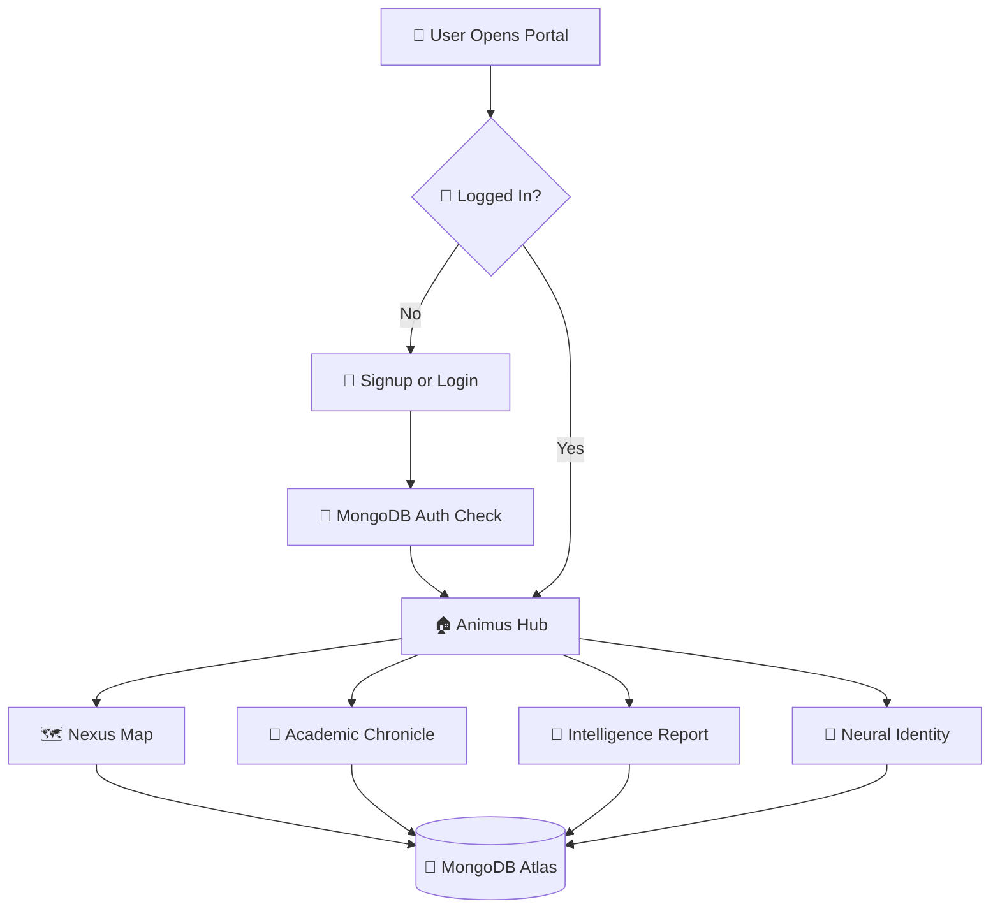

<div align="center">


<a href="https://github.com/AbdulAzeemHashmi/Aether-Student-Portal">
  
</a>

<br/>

[](https://flask.palletsprojects.com/)
[](https://www.mongodb.com/cloud/atlas)
[](https://developer.mozilla.org/en-US/docs/Web/JavaScript)
[](https://www.python.org/)
[](https://github.com/AbdulAzeemHashmi/Aether-Student-Portal/stargazers)
[](LICENSE)

<br/>

🏠 [Features](#-feature-breakdown) &nbsp;•&nbsp; 🚀 [Getting Started](#-getting-started) &nbsp;•&nbsp; 📡 [API Reference](#-api-reference) &nbsp;•&nbsp; 🎨 [Design Philosophy](#-design-philosophy) &nbsp;•&nbsp; 🤝 [Contributing](#-contributing)

</div>

---

## 🌌 What is AETHER?

AETHER is a full stack academic management platform built around a high fidelity **Zenith Glass** design language. ✨ It consolidates everything a university student needs into one unified, visually immersive workspace, from tracking GPA trajectories 📈 to mapping course prerequisites 🗺️ and visualizing semester timelines 📜.

Most student portals are utilitarian and forgettable. AETHER is built on the belief that the tools you use every day should feel exceptional. 💎

> 🧠 **Think of it as a premium operating system for your academic life.** Each page is a dedicated module. Together they form a complete ecosystem.

<div align="center">

</div>

> 💡 Tip: Swap the animation above for a real screen capture of the Animus Hub once you record one. **ScreenToGif** or **Peek** work great for that.

---

## 🚨 Security Notice, Read Before Pushing

The `app.py` file currently contains a **hardcoded MongoDB connection URI** with real credentials. ⚠️ Before pushing this repository to GitHub, you must remove it.

### 🔒 Step 1: Create a `.env` file in the root directory

```env
MONGO_URI=mongodb+srv://<username>:<password>@cluster0.xxxxx.mongodb.net/?retryWrites=true&w=majority
```

### 🔒 Step 2: Install `python-dotenv`

```bash
pip install python-dotenv
```

### 🔒 Step 3: Update the top of `app.py`

```python
from dotenv import load_dotenv
import os

load_dotenv()
MONGO_URI = os.getenv("MONGO_URI")
```

### 🔒 Step 4: Add `.env` to your `.gitignore`

```
.env
__pycache__/
*.pyc
```

✅ Your credentials are now safe. Never commit a raw connection string to a public repository.

---

## ✨ Feature Breakdown

<table>
<tr>
<td width="50%">

### 🏠 Animus Hub
The central command dashboard. Displays at a glance stats including current GPA, credit hours completed, and academic health scores. Serves as the launch pad for all other modules via a sleek glassmorphism grid.

</td>
<td width="50%">

### 🗺️ Nexus Map
An interactive skill tree graph that visualizes the prerequisite topology of your entire degree. Courses are nodes, prerequisites are directed edges. Unlock progression as you advance semester by semester.

</td>
</tr>
<tr>
<td width="50%">

### 📜 Academic Chronicle
A scroll triggered, alternating 3D timeline across all 8 semesters. Completed semesters display solidified GPA and course data. Future semesters appear as quantum possibilities, rendered with cinematic IntersectionObserver animations.

</td>
<td width="50%">

### 🧠 Intelligence Report
An AI driven analysis panel that evaluates your GPA trend, academic health score, and flags gatekeeper courses that may affect your graduation trajectory. Turns raw data into actionable insight.

</td>
</tr>
<tr>
<td width="50%">

### 👤 Neural Identity
A persistent profile page for synchronizing your name, roll number, email, password, and profile photo across all devices. All changes cascade correctly through the database, including roll number updates.

</td>
<td width="50%">

### 🔐 Auth System
Secure registration and login backed by MongoDB. Enforces roll number format validation (`24I-2013` style), minimum password length, and duplicate account prevention at the database index level.

</td>
</tr>
</table>

---

## 🛠️ Tech Stack

| Layer | Technology | Purpose |
|---|---|---|
| 🐍 **Backend** | Python 3.9+, Flask 3.0, Flask CORS | REST API, static file serving, routing |
| 🍃 **Database** | MongoDB Atlas, pymongo 4.7 | Cloud hosted document storage |
| 🌐 **Frontend** | Vanilla HTML5, CSS3, JavaScript ES6+ | All UI, animations, and API calls |
| 🔤 **Fonts** | Outfit, Space Grotesk, Inter | Display, UI, and body typography |
| 🧊 **3D / FX** | CSS `preserve-3d`, `backdrop-filter` | Glassmorphism, parallax, card depth |
| 📊 **Extras** | python-pptx | Report generation and export |

---

## 🚀 Getting Started

### ✅ Prerequisites

Before you begin, make sure you have the following ready:

* 🐍 **Python 3.9+** ([download](https://www.python.org/downloads/))
* 📦 **pip** (bundled with Python)
* 🌿 **Git** ([download](https://git-scm.com/))
* 🌐 An active internet connection (for MongoDB Atlas and Google Fonts)
* 🍃 A free [MongoDB Atlas](https://www.mongodb.com/cloud/atlas) account

### 1️⃣ Clone the Repository

```bash
git clone https://github.com/AbdulAzeemHashmi/Aether-Student-Portal.git
cd Aether-Student-Portal
```

### 2️⃣ Set Up Environment Variables

Create a `.env` file in the root of the project:

```env
MONGO_URI=your_mongodb_atlas_connection_string_here
```

### 3️⃣ Install Dependencies

```bash
pip install -r requirements.txt
pip install python-dotenv
```

### 4️⃣ Launch the Server

```bash
python app.py
```

On a successful start you will see:

```
Checking Database Integrity...
Database Ready.
 * Running on http://0.0.0.0:3000
```

🌱 The app auto seeds all course data and creates database indexes on first run. No manual setup needed.

### 5️⃣ Open the Platform

| Device | URL |
|---|---|
| 💻 PC / Laptop | `http://localhost:3000` |
| 📱 Mobile (same WiFi) | `http://<your-local-ip>:3000` |

Register a new account via **Join AETHER** and sign in. Roll number format: `24I-2013`. ✅

<div align="center">

</div>

---

## 📁 Project Structure

```
Aether-Student-Portal/
│
├── app.py                  🐍 Flask server, REST API, MongoDB logic
├── requirements.txt        📦 Python package dependencies
├── .env                    🔒 Secret credentials (never commit this)
├── .gitignore              🚫 Excludes .env, __pycache__, etc.
│
├── login.html              🔑 Authentication entry point
├── signup.html             📝 New user registration
├── hub.html                🏠 Animus Hub, the main dashboard
├── nexus.html              🗺️ Nexus Map, prerequisite skill tree
├── chronicle.html          📜 Academic Chronicle, semester timeline
├── analysis.html           🧠 Intelligence Report, AI driven analysis
├── profile.html            👤 Neural Identity, profile editor
│
└── README.md               📄 this file
```

---

## 📡 API Reference

All endpoints accept and return `application/json`. Every response includes a `success` boolean. On failure, a `message` field describes the error.

| Method | Endpoint | Body / Params | Description |
|---|---|---|---|
| 🟢 `POST` | `/api/login` | `{ roll, pass }` | Authenticate a user, returns full user object |
| 🟢 `POST` | `/api/register` | `{ name, roll, pass }` | Register a new student, seeds course progress |
| 🟢 `POST` | `/api/update-user` | `{ orig_roll, full_name, roll_number, password, email, photo }` | Update profile, cascades roll number change to progress collection |
| 🔵 `GET` | `/api/get-profile/:roll` | URL param: `roll` | Retrieve stored profile data for a student |
| 🟢 `POST` | `/api/get-profile` | `{ roll, profile_data }` | Save a profile data blob for a student |

### 🧪 Example: Login Request

```bash
curl -X POST http://localhost:3000/api/login \
  -H "Content-Type: application/json" \
  -d '{"roll": "24I-2013", "pass": "mypassword"}'
```

```json
{
  "success": true,
  "user": {
    "roll_no": "24I-2013",
    "full_name": "Abdul Azeem",
    "email": "azeem@example.com"
  }
}
```

---

## 🎨 Design Philosophy

AETHER is built around a single principle, **academic tools should not look academic.** 💫

Every visual decision is intentional:

| Principle | Implementation |
|---|---|
| 🌑 **Dark first** | Near black `#030303` base to eliminate eye strain |
| 🪟 **Glassmorphism** | `backdrop-filter: blur()` with translucent card surfaces |
| 🌫️ **Ambient depth** | Large blurred gradient blobs that respond to mouse parallax |
| 🧊 **3D structure** | CSS `transform-style: preserve-3d` and `perspective` on cards |
| 🎞️ **Scroll choreography** | IntersectionObserver powered entrance animations throughout |
| 🔤 **Type hierarchy** | Outfit for display, Space Grotesk for UI, Inter for body copy |
| 🎨 **Color language** | Indigo `#6366f1` for primary actions, pink `#ec4899` for highlights |

---

## 🧬 System Flow



---

## 🗺️ Roadmap

* [ ] 🔒 Migrate credentials fully to `.env` with `python-dotenv`
* [ ] 🪪 Add JWT based session management to replace `localStorage` auth
* [ ] ✍️ Build a course grade entry UI that feeds the Chronicle and Intelligence Report
* [ ] 📈 Add GPA projection calculator with what if scenario modeling
* [ ] 📄 Export academic report as a styled PDF via `python-pptx` or `weasyprint`
* [ ] 🌗 Add dark/light mode toggle
* [ ] 📱 Mobile PWA support

---

## 🤝 Contributing

Contributions are welcome from anyone who respects the design language. 🙌

```bash
# 1. Fork the repository on GitHub 🍴

# 2. Clone your fork
git clone https://github.com/your-username/Aether-Student-Portal.git

# 3. Create a feature branch
git checkout -b feature/your-feature-name

# 4. Make your changes, then commit
git commit -m "feat: describe what you added"

# 5. Push and open a Pull Request 🚀
git push origin feature/your-feature-name
```

**Guidelines:** 📋

* Keep all UI consistent with the Zenith Glass aesthetic (dark backgrounds, glassmorphism, indigo/pink palette) 🎨
* Do not introduce external CSS frameworks, keep the frontend dependency free 🚫
* Backend changes must preserve the existing API response shape so the frontend does not break 🔧
* All new features must be responsive down to 375px viewport width 📱

---

## 📄 License

This project is licensed under the **MIT License**. See the [LICENSE](LICENSE) file for full details.

---

<div align="center">
  <br/>

  

  <br/><br/>

  

  <br/><br/>

  <sub>✨ Crafted with precision under Zenith Glass Design Principles, AETHER Protocol ✨</sub>

  <br/><br/>

  ⭐ **If this project helped you, consider giving it a star on GitHub!** ⭐

  

</div>
